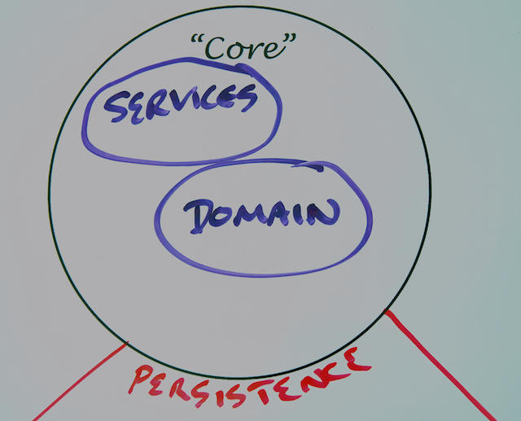
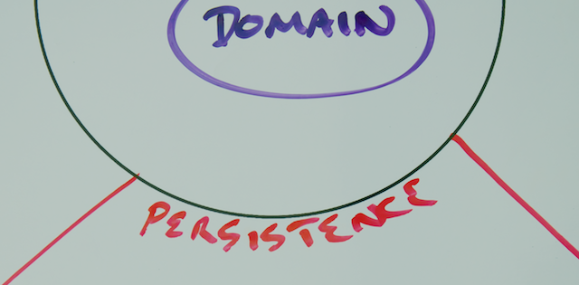

## Step 1: Modelling the Core & Persistence Domains

> **Note:** For those who have already encountered the **Yummy Noodle Bar** in another tutorial in the series the following section is an introductory recap of the Yummy Noodle Bar core domain. If you're already familiar with the core domain you can skip down to **Modelling the Persistence Domain**.

Currently the core application internal domain of the Yummy Noodle Bar is made up of the following sub-domains:

* **Domain**. Contains the core domain classes that captures the key concepts of the application in the [ubiquitous language](http://martinfowler.com/bliki/UbiquitousLanguage.html) of the system.

* **Services**. Contains the components that exercise the core domain classes to provide the unique functionality for the application.

Each of these domains map to Java packages. Take a moment to get familiar with the components in each of these domains in the [core domain source code](https://github.com/spring-guides/tut-data/tree/master/initial/src/main/java/com/yummynoodlebar/core/domain) and the [core services domain source code](https://github.com/spring-guides/tut-data/tree/master/initial/src/main/java/com/yummynoodlebar/core/services).

Focusing primarily on Orders, these can be acted upon by a number of events:

* **OrderCreatedEvent**. Creates a new order for a number of menu-items.

* **OrderUpdatedEvent**. Updates an existing Order with some additional information, possibly payment information.

* **OrderDeletedEvent**. Deletes an existing order if it is not being cooked.

* **RequestAllCurrentOrdersEvent**. Requests the full list of all current orders be returned.

## Modelling the Persistence Domain

First up, the ability to create, update and remove Orders, MenuItems and OrderStatuses is your first task.

It can be tempting to simply map the core Order domain to the data stores and work from there, but that would ignore the boundary between the Core and the Persistence domain.

The data model of your persisted data will need to change at a rate that is manageable and technically feasible given the data store implementation. The core will need to evolve at the rate the Yummy Noodle bar system needs to internally evolve at. There is potentially friction between the two domains as they evolve at different rates.

To manage this friction you need to create concepts and components in the Persistence domain that are unique to, and can evolve at the rate needed by, the Persistence domain itself. This may result in similar types of components, but since their purpose will be very different the similarities are superficial.

## Understanding the Different Data Models and their Implementations

Modern data stores adopt one or more Data Models, typically only one per technology. 

Your interactions with a data store, based on the features and limitations of its data model, will vary and so different capabilities and data access patterns are applied.

Some of the most common Data Models currently in use are:

* **Relational**

	The relational model of data storage is characterised by the concepts of Tables, with structured Columns made up of Rows.  This is is very analogous to a spreadsheet, where a table is like a worksheet, a row represents one record, and a column contains one specific piece of information. They are accessed by a dialect of the Structured Query Language (SQL). 

	What makes this type of data store relational is the way that Columns may define references to Columns in other tables, known as relations. These relations are usually strongly enforced by the database.

	Relational Databases are highly structured, have an explicit Schema and almost invariably first class support for transactions.

	You will see the H2 Database in use in this tutorial, supported by [Spring Data JPA](http://projects.spring.io/spring-data-jpa/)
    
* **Document**

	A data store following the Document Data Model will have a far looser schema than a relational database, if it has one at all. Documents are structured, rich data structures that can contain nested documents, lists, maps and other constructs internally, all within a single document. Some elements of the documents can be optional, giving huge flexibility to the system designer.

	Queries can be written against any value in the document structure, leading to very rich querying capabilities and document structures.  A distinct difference with relational databases is that the logical collections of documents do not have to conform to a common schema. Documents aren't as heavily defined by relationships between columns, but instead more focused on the content of the documents.

	You will see MongoDB in use in this tutorial, supported by [Spring Data MongoDB](http://www.springsource.org/spring-data/mongodb)

* **Data Grid**

	Data Grid is less well defined than the other models, but mostly commonly means a Key/Value store that has advanced replication and server side data processing built in. This is sometimes viewed as a caching data solution.

	GemFire is such a store, and allows accessing data through either a Map interface, a rich query language, or writing code that executes on the GemFire cluster in a distributed fashion.

	It is supported by [Spring Data GemFire](http://www.springsource.org/spring-gemfire)

* **Key/Value**

	Key/Value is one of the simplest forms of Data Model.  It is analogous to a Java Map, known in other languages as either a hash table, hash map, or an associative array. The data entries comprise a key with an associated value. They tend to be very fast and easily distributable. This is sometimes used as a caching data solution. Because many critical, high performance systems depend on such simple constructs, Key/Value data stores have risen quickly in popularity.

	Some implementations offer a querying capability against the value data.

	No implementation of a simple key/value store is used in this tutorial. Redis is supported by [Spring Data Redis](http://www.springsource.org/spring-data/redis)

[Next… Storing Menu Data Using MongoDB](../2/)

