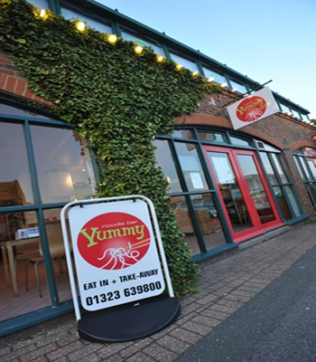

In this tutorial you'll use Spring to store data in multiple data stores.

> **Note:** Are you just joining the **Yummy Noodle Bar** tutorial series? This tutorial is a follow up to [Designing and Implementing RESTful Web Services with Spring](/guides/tutorial/rest). It has the same concepts and many of the same domain objects. You can continue and see how to add data storage in this tutorial, or if you prefer, go visit that tutorial first.

## Persistence and Storage

The field of Data Persistence has progressed enormously over the past 20 years. In the present day it covers a myriad of data models and data storage implementations.

Adopting the right data model and data store for your application can be a complex process and is often decided at the start of a project and set in stone from thereon.

Since you're reading this tutorial, it's likely that you are considering implementing a Repository because:

* You have a data store that you need to access
* You have an existing Spring Data application that you need to maintain
* You want to investigate different data stores in the context of Spring Data

This tutorial covers three data stores: MongoDB, a relational database using JPA and Pivotal GemFire. 

## What you'll build

Yummy Noodle Bar is going global.  As part of its planned expansion, it needs to be able to store and update its Menu, and store Orders in the appropriate database(s).

You will extend Yummmy Noodle Bar's internal application to:
- Store Menu data in MongoDB
- Store Order data in a Relational Database
- Track the Status of an Order using GemFire. 

Spring Data will provide the bedrock of your persistence project, and you will discover how it makes your data access simpler, more consistent and more robust.




## What you'll need
To work through this tutorial you'll need a few things:

* About a half hour for each section. You might finish it in a week during your lunch break (or during the weekend!)
* A copy of the code (available either by [git][u-git] or a [downloadable zip file](https://github.com/spring-guides/tut-data/archive/master.zip)).
* An IDE of your choice. Spring recommends [Spring Tool Suite](http://www.springsource.org/sts), which is a [free download](http://www.springsource.org/sts).
* An installation of [MongoDB](http://www.mongodb.org/)

### Downloading and running the code

If you download the code base, you'll discover each section of this tutorial in a separate folder, numbered 1, 2, 3, etc. There are also several code drops: an **initial** one at the root, and a separate **complete** code drop for each section.

The **initial** code set contains:
- a project layout
- the core domain & event classes this tutorial starts off creating (the 'Yummy Noodle Bar Application', above)
- some basic unit tests for some of those classes

The **complete** code set in each section includes the initial code base plus the code developed up to that point in the tutorial.

You can choose to start with the **initial** code set. Or you can start with the **complete** code set for a given section. Not every code file is displayed in the tutorial, because that would slow things down too much. But important ones are such as writing tests, creating data oriented interfaces services, and looking at some key domain objects.

While there are many build systems, this tutorial is built using [Gradle][gs-gradle] and includes the Gradle Wrapper, so you don't have to install anything to run the code.

For example, if you want to check out the initial code set:

```sh
$ git clone git@github.com:spring-guides/tut-data.git
$ cd tut-data/initial
$ ./gradlew clean test
```

From there, you can inspect `build/reports/tests` and see all the test results.

[u-git]: /understanding/Git
[gs-gradle]: /guides/gs/gradle

## The Home of Repositories in your Application Architecture

Repositories are an integration between the external, persistent storage engines and your core application. Repositories can be seen as living in their own integration domain on the periphery of your applications core as shown in the following diagram:

TBD Where Repositories sit in the Life Preserver diagram to be added.

As an integration between your application core and the outside world there are a number of concerns that need to be addressed in the design and implementation of the components that make up the Repositories:

* Primary purpose of Repository components is to integrate your application with the data stores in a natural and optimised way.
* Components of your persistence domain will need to evolve at a rate that is appropriate for the data they are managing.
* Your Repository components should not contain any core logic. They should instead focus on collaborating with other components in the core domain of your application in order to support needed functionality for the service layer.

That's enough on the design constraints placed on the components that implement your Repositories, the rest of this tutorial looks at how to implement those components using Spring:

* [Step 1: Understanding your Data Model and Modelling the Persistence Domain](1/)
* [Step 2: Storing Menu Data Using MongoDB](2/)
* [Step 3: Storing Order Data Using JPA](3/)
* [Step 4: Storing the Order Status in GemFire using Spring Data GemFire](4/)
* [Step 5: Extending the Persistence Domain to Send Events](5/)
* [Recap and Where to go Next?](6/)

